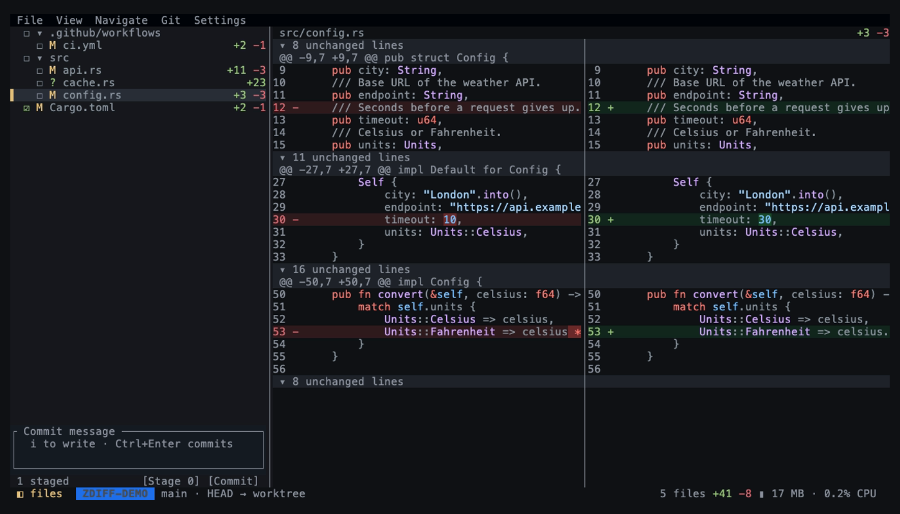
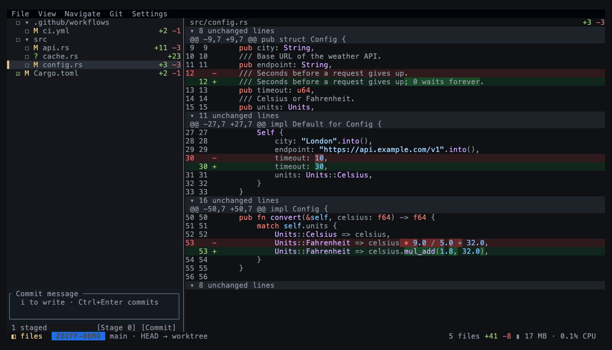
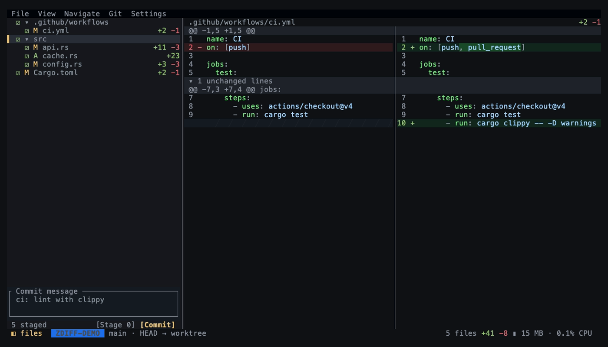
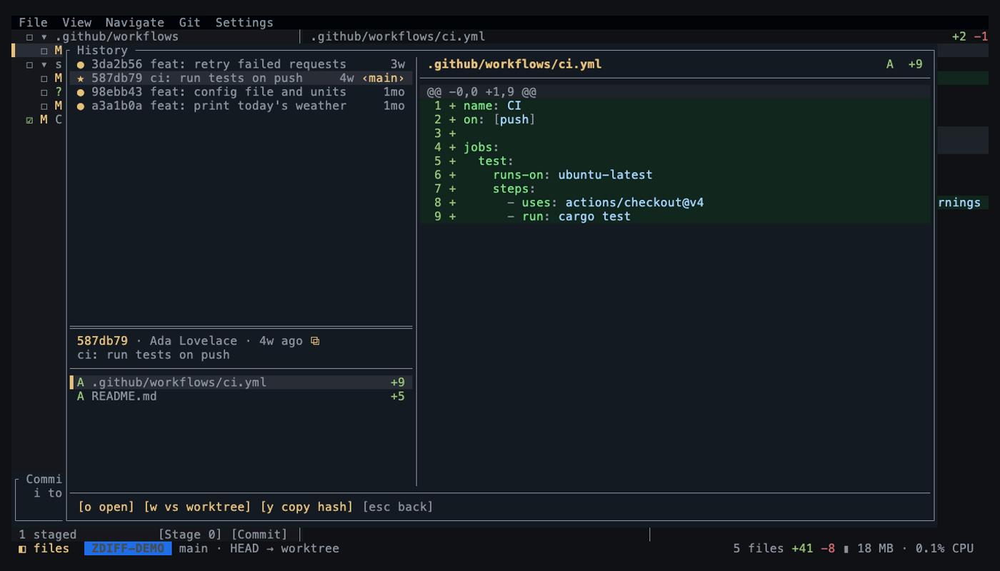
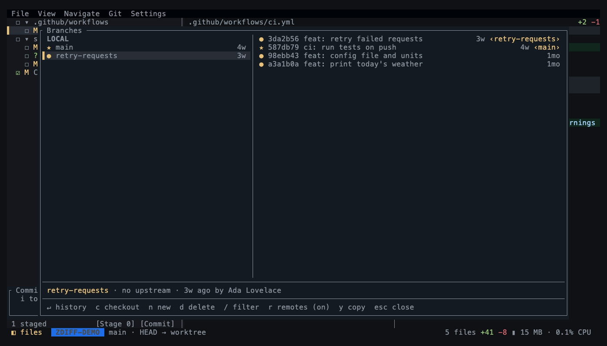

# zdiff guide

This guide covers every feature, the default keys, and the settings file. Read the [README](../README.md) first for install steps.

- [What zdiff shows](#what-zdiff-shows)
- [Command line](#command-line)
- [The screen](#the-screen)
- [Moving around](#moving-around)
- [Views and folds](#views-and-folds)
- [Find and search](#find-and-search)
- [Watch mode](#watch-mode)
- [Stage and commit](#stage-and-commit)
- [History](#history)
- [Stashes](#stashes)
- [Branches](#branches)
- [Images and SVG](#images-and-svg)
- [Patch files](#patch-files)
- [Settings](#settings)
- [All default keys](#all-default-keys)

## What zdiff shows

zdiff compares `HEAD` with the files on disk, like `git diff HEAD`. Staged and unstaged changes both show, and so do untracked files.

Run it anywhere inside a repository. Paths you give are relative to the current directory.

## Command line

```text
zdiff [OPTIONS]

  -w, --watch            Refresh the diff as files change
      --read-only        No staging or committing, whatever the settings say
      --patch <FILE>     View a patch file instead of the repository; `-` reads stdin
  -f, --focus <PATH>...  Show only these files, folders, or globs
  -h, --help
  -V, --version
```

Examples:

```bash
zdiff -f src/app.rs src/ui     # one file and one folder
zdiff -f 'crates/**/*.rs'      # quote globs so the shell leaves them alone
```

## The screen

- **Menu bar** (top row). Press `F10` or click a menu. Every action is in a menu, with its key next to it.
- **Sidebar** (left). Changed files in a folder tree. Each row has a status letter and `+added -removed`. Drag its edge to resize. `Ctrl+B` hides it.
- **Diff pane** (right). The selected file's diff.
- **Footer** (bottom). Totals, the current mode, messages, and a badge with zdiff's own memory and CPU use.

`Tab` moves focus between the sidebar and the diff. The mouse works too: click files and folders, and scroll with the wheel.

## Moving around

| Key | In the diff | In the sidebar |
|---|---|---|
| `j` / `k`, arrows | Scroll one line | Next / previous file |
| `Ctrl+D` / `Ctrl+U` | Half page | |
| `PageDown` / `PageUp` | Full page | Full page |
| `g` / `G` | Top / bottom | First / last file |
| `h` / `l` | Scroll left / right | Close / open folder |
| `]` / `[` | Next / previous change | |
| `Enter` | Open the fold under the cursor | Open / close folder |

From anywhere:

- `n` / `p`: next / previous file.
- `Ctrl+P`: go to file. Type part of a path; matching is fuzzy.
- `Ctrl+G`: go to line.

## Views and folds



- `v` switches between **split** (old left, new right) and **unified** (one column). In **Auto**, the default, the view follows the pane width. Pick Auto in the View menu.
- `a` switches between **single file** and **All files**. All files stacks every diff in one scroll. Only the sections near the screen are loaded, so a big change set stays light.
- Unchanged code folds away and leaves a few context lines around each change. `+` / `-` show more or fewer context lines. `e` opens every fold, `c` closes them again.
- `w` turns word highlights on or off. They mark the exact words that changed inside a line.
- The View menu has **Save layout as default**. It saves the view, scope, sidebar side and width, and context lines for the next start.



## Find and search

- `Ctrl+F`: find in the current file. Hits are highlighted, and the footer counts them.
- `Ctrl+Shift+F`: search all changed files. A background thread runs it and streams the hits, so the UI stays live. Pick a hit to jump to it.

## Watch mode


`zdiff --watch` refreshes when files change. Only the changed paths get a new diff; a full status runs only when `.git/index` or `HEAD` changes. Your selection and scroll position stay where they are.

`Ctrl+R` reloads by hand. To watch on every start, turn on **Watch for changes (next start)** in the menu.

## Stage and commit

Staging is on by default. `--read-only` or the **Staging** setting turns it off.

1. In the sidebar, press `Space` to check or uncheck a file.
2. Press `s` to stage the checked files.
3. Press `i` to jump to the commit box and write the message.
4. Press `Ctrl+Enter` to commit.



## History

`L` opens the history popup. It has three panes: the commit graph and list, the selected commit's files, and a preview of the selected file.



| Key | Does |
|---|---|
| `/` | Search commits |
| `Enter` | Open the commit's files, then a file's preview |
| `o` | Open the commit in the main view |
| `w` | Compare the commit with your working tree |
| `y` | Copy the commit hash |
| `Esc` | Back one pane, or close |

More commits load as you scroll down.

## Stashes

`Z` opens the stash list. It works like history, plus:

| Key | Does |
|---|---|
| `s` | Stash your current changes |
| `a` | Apply the stash |
| `p` | Pop the stash (apply, then drop) |
| `d` | Drop the stash (asks first) |
| `b` | Make a branch from the stash |

## Branches

`B` opens the branches popup. Local branches, remote branches, and tags are on the left. The right side shows the selected branch's graph against `HEAD`. Each local branch shows its upstream, how far ahead and behind it is, and whether the upstream is gone.



| Key | Does |
|---|---|
| `/` | Filter by name |
| `Enter` | Open the branch's history |
| `c` | Check out. A remote branch becomes a new local tracking branch. A tag checks out detached. |
| `n` | New branch from the selected one |
| `d` | Delete a local branch. It asks again before deleting an unmerged one. |
| `r` | Show or hide remote branches |
| `y` | Copy the name |

## Images and SVG

The terminal must support an image protocol, such as Kitty, iTerm2, WezTerm, Ghostty, or Sixel. Then changed PNG, JPEG, GIF, WebP, BMP, and ICO files show as pictures.

- `o` cycles the compare mode: **2-up** (side by side), **swipe** (old left of a divider, new right), and **onion skin** (new faded over old).
- SVG files show as code by default. `r` switches between code and the rendered picture. The **SVG preview by default** setting opens them rendered.

The **Image previews** setting turns pictures off.

## Patch files

```bash
zdiff --patch changes.patch
git format-patch -1 --stdout | zdiff --patch -
gh pr diff 42 | zdiff --patch -
```

A patch holds only hunks. When you run zdiff inside the repository the patch came from, it reads the base files and shows whole files with folds. Outside that repository it shows the hunks, and marks the lines between them as "not in the patch".

`Ctrl+R` reloads a patch file from disk. Stdin can't be reloaded.

`--watch` can't be used together with `--patch`.

## Settings

zdiff saves settings to `$XDG_CONFIG_HOME/zdiff/config.toml`, else to `~/.config/zdiff/config.toml`. The menus write the file for you. You can also edit it by hand. Missing keys use their defaults. If the file has an error, zdiff warns you and uses the defaults.

```toml
[general]
syntax = true          # syntax highlighting
watch = false          # watch without --watch
staging = true         # checkboxes, Stage, and Commit
images = true          # pictures for changed images
svg_preview = false    # SVGs open rendered
usage = true           # memory and CPU badge in the footer
theme = "github-dark"

[keys]
find = ["Ctrl+F", "/"]
quit = ["q"]
```

**Themes**: `github-dark`, `github-light`, `github-dark-dimmed`, `tokyo-night`, `catppuccin-mocha`, `catppuccin-latte`, `dracula`, `nord`, `gruvbox-dark`, `solarized-light`, `rose-pine`, `kanagawa`, and more. Open **Theme…** in the menu to try them live.

**Keys**: `Ctrl+K` opens the shortcuts screen, where you can rebind any action. It warns you when a key is already in use. In the file, each `[keys]` entry replaces that action's keys. Names look like `Ctrl+F`, `Alt+X`, `Shift+Tab`, `Space`, `Enter`, `F5`, `Up`. `Esc` and `Ctrl+C` always cancel or quit, so you can't rebind them.

## All default keys

| Key | Action | Where |
|---|---|---|
| `F10` | Open menu | everywhere |
| `Ctrl+K` | Keyboard shortcuts | everywhere |
| `Ctrl+P` | Go to file | everywhere |
| `Ctrl+G` | Go to line | everywhere |
| `Ctrl+F` | Find in file | everywhere |
| `Ctrl+Shift+F` | Search all files | everywhere |
| `Ctrl+B` | Sidebar | everywhere |
| `Ctrl+R` | Reload | everywhere |
| `q`, `Esc` | Quit | everywhere |
| `Tab` | Switch focus | everywhere |
| `n` / `p` | Next / previous file | everywhere |
| `v` | Switch split / unified | everywhere |
| `a` | Switch single / all files | everywhere |
| `e` / `c` | Expand / collapse all folds | everywhere |
| `+` or `=` / `-` | More / less context | everywhere |
| `w` | Word highlights | everywhere |
| `r` | SVG as code or picture | everywhere |
| `L` | History | everywhere |
| `Z` | Stashes | everywhere |
| `B` | Branches | everywhere |
| `i` | Commit message box | everywhere |
| `Ctrl+Enter` | Commit | everywhere |
| `j` / `k`, `↓` / `↑` | Scroll | diff |
| `Ctrl+D` / `Ctrl+U` | Half page down / up | diff |
| `PageDown` / `PageUp` | Page down / up | diff |
| `g` or `Home` / `G` or `End` | Top / bottom | diff |
| `]` / `[` | Next / previous change | diff |
| `Enter` | Expand fold | diff |
| `o` | Image compare mode | diff |
| `h` / `l`, `←` / `→` | Scroll left / right | diff |
| `j` / `k`, `↓` / `↑` | Next / previous file | sidebar |
| `PageDown` / `PageUp` | Page down / up | sidebar |
| `g` or `Home` / `G` or `End` | First / last file | sidebar |
| `Enter` | Open / close folder | sidebar |
| `Space` | Check / uncheck file | sidebar |
| `s` | Stage checked | sidebar |
| `h` / `l`, `←` / `→` | Close / open folder | sidebar |
